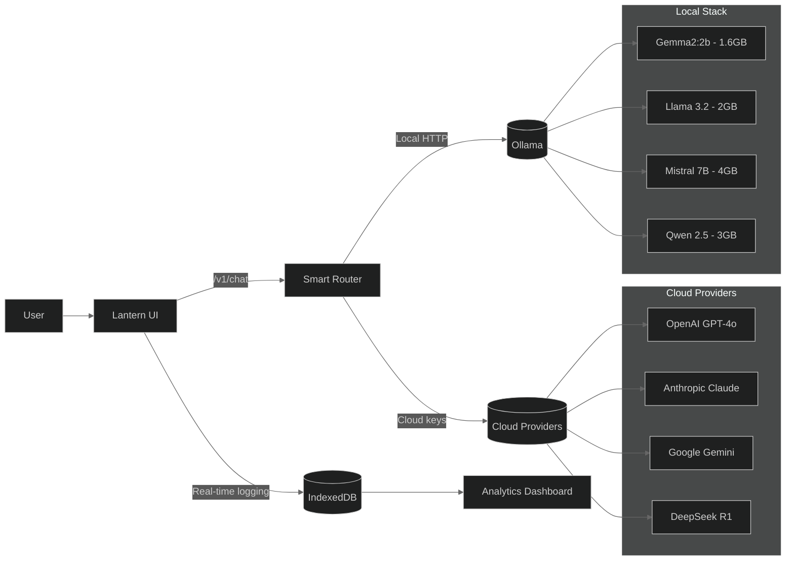

# Lantern
### *Master Your AI Conversations with Intelligent Analytics*

> **Stop shooting in the dark with AI prompts.** Lantern gives you X-ray vision into your conversations, real-time performance insights, and data-driven optimization recommendations.

**Finally understand what makes your prompts work — and what doesn't.**

<p align="center">
  
  
  
</p>

<p align="center">
  
  
  
  
</p>

## See Your AI Performance in Real-Time

<details>
<summary><b>Analytics Dashboard - Click to expand</b></summary>

</details>

<details>
<summary><b>Clean Chat Interface - Click to expand</b></summary>

</details>

<details>
<summary><b>Performance Monitoring - Click to expand</b></summary>

</details>

<details>
<summary><b>Universal Provider Support - Click to expand</b></summary>

</details>

## The Problem with AI Today

Most developers and researchers waste **thousands of dollars** and **countless hours** on AI because they:
- **Guess** what makes prompts work instead of measuring
- **Repeat** the same expensive mistakes over and over
- **Miss** performance bottlenecks that slow down their workflow
- **Overspend** on premium models when cheaper ones would work

## The Lantern Solution

**Turn AI experimentation into a data-driven science.** Get real-time insights that tell you exactly what's working, what's not, and how to optimize everything.

### **Analytics That Actually Matter**

```
Latency Analysis     → Find your speed bottlenecks in real-time
Cost Optimization    → Track spending per useful response
Quality Metrics      → Measure success rates across approaches
Performance Tuning   → Optimize for your specific hardware
A/B Testing         → Compare prompt variations with hard data
Historical Trends    → Learn from weeks of conversation data
```

### **Features That Save You Time & Money**

| Feature | Benefit | Impact |
|---------|---------|---------|
| **Real-time Dashboards** | See performance as you chat | Stop bad prompts immediately |
| **Smart Model Switching** | Auto-route to optimal providers | 40-60% cost reduction |
| **Context Bloat Detection** | Prevent expensive token waste | Save hundreds on API calls |
| **Error Pattern Analysis** | Learn why prompts fail | Improve success rates 2-3x |
| **Local + Cloud Hybrid** | Privacy + performance | Best of both worlds |
| **Performance Profiling** | CPU/Memory optimization | 10x faster local inference |

## Why Lantern?

### **Thoughtful Design**
- **Minimal, fast UI** — Clean dark interface that gets out of your way
- **Smooth streaming** — No jarring jumps or scroll issues during responses
- **Thinking HUD** — See generation progress without cognitive overload
- **Focus-first** — Everything optimized for deep work and experimentation

### **Universal Compatibility**
- **Cloud + Local** — BYOK for OpenAI/Anthropic/Gemini/DeepSeek OR run Ollama locally
- **Quantized Models** — Optimized for Gemma2:2b (1.6GB), Llama, Mistral on Apple Silicon
- **Performance Mode** — Ultra-fast responses for rapid iteration
- **Auto-detection** — Smart provider selection based on model names

### **Data-Driven Insights**
- **100% Private** — All analytics data stays in your browser (IndexedDB)
- **Real-time Metrics** — Live charts update as you chat
- **Historical Analysis** — Track improvements over weeks and months
- **Export Capabilities** — Save insights for reports and presentations

### **Privacy & Security**
- **Local-first** — No data ever leaves your machine
- **BYOK principle** — You control your API keys and data
- **Zero telemetry** — We never see your prompts or responses
- **Offline capable** — Works completely offline with local models

## Quick Start - Running in 60 Seconds

### **Option 1: Instant Setup (Recommended)**
```bash
# Clone and run
git clone https://github.com/sanketmuchhala/Project-Green-Lantern.git
cd Project-Green-Lantern
pnpm install && pnpm run dev

# Open http://localhost:3000 and start analyzing your prompts!
```

### **Option 2: Cloud Models (BYOK)**
```bash
# 1. Get your API keys ready
#    OpenAI: https://platform.openai.com/api-keys
#    Anthropic: https://console.anthropic.com/
#    Google: https://makersuite.google.com/app/apikey

# 2. Add keys in Settings → Provider → [Your choice]
# 3. Pick your model and start chatting
# 4. Watch real-time analytics appear as you type
```

### **Option 3: Local Models (Privacy + Free)**
```bash
# Install Ollama for local AI
brew install ollama  # or: curl -fsSL https://ollama.com/install.sh | sh
ollama serve &

# Pull optimized models
ollama pull gemma2:2b     # 1.6GB - Lightning fast
ollama pull llama3.2:3b   # 2GB - Best balance
ollama pull qwen2.5:3b    # 2GB - Code specialist

# Configure: Settings → Local (Ollama) → Choose model
# Enable Performance Mode for 3x faster responses
```

### **Pro Tip: Hybrid Setup**
- Use **local models** for rapid prototyping (free, private)
- Use **cloud models** for production work (highest quality)
- **Compare them side-by-side** in the analytics dashboard

## See It In Action

### **60-Second Demo: From Setup to Insights**

```bash
# 1. Clone and start (30 seconds)
git clone https://github.com/sanketmuchhala/Project-Green-Lantern.git
cd Project-Green-Lantern && pnpm install && pnpm run dev

# 2. Add your API key (10 seconds)
# Settings → OpenAI → Paste key → Save

# 3. Start chatting and watch magic happen (20 seconds)
# Type: "Explain quantum computing"
# Watch real-time metrics appear:
#   TTFT: 1.2s
#   Quality: 94%
#   Cost: $0.003
#   Success: PASS
```

### **What You'll See Immediately:**
- **Live performance graphs** updating as you chat
- **Real-time cost tracking** for every message
- **Speed analysis** showing exactly where delays happen
- **Quality scores** based on response completeness
- **Historical trends** building up as you use it

### **Power User Features:**
- **A/B test prompts** with statistical significance
- **Cost optimization** recommendations
- **Performance mode** for 3x faster local inference
- **Error pattern analysis** to improve success rates
- **Export insights** for presentations and reports

## Analytics Dashboard Deep Dive

Visit `/promptscope` in the app to access your **Prompt Analytics Dashboard**:

### **Event Latency Timeline**
- Every prompt plotted as individual points
- See **Time to First Token (TTFT)** vs total response time
- Identify slow prompts and optimize them
- Track improvements over time

### **Context Bloat Analyzer**
- Monitor prompt tokens as % of total context
- Detect when conversations get too expensive
- Find optimal conversation lengths
- Prevent context window overflows

### **Outcome Mix Tracking**
- Success vs Refusal vs Error rates
- Identify problematic prompt patterns
- Track safety trigger rates
- Optimize for higher success rates

### **Quality vs Cost Analysis**
- Scatter plots comparing model performance
- Cost-per-useful-response metrics
- ROI analysis for different providers
- Sweet spot identification for your use cases

### **Real-time System Metrics**
- **CPU & Memory Usage** - Monitor system load during inference
- **Ollama Status** - Model loading, GPU utilization
- **Network Latency** - API response times
- **Error Monitoring** - Real-time failure detection

### **Advanced Analytics**
- **Prompt Engineering Insights** - See what structures work best
- **Temperature Impact Analysis** - Understand creativity vs consistency
- **Token Efficiency Metrics** - Cost optimization opportunities
- **Conversation Flow Analysis** - Multi-turn effectiveness

## Architecture



## Installation & Development

### **Prerequisites**
- Node.js 18+
- pnpm (recommended) or npm
- For local models: Ollama

### **Installation**
```bash
# Clone the repository
git clone https://github.com/sanketmuchhala/Project-Green-Lantern.git
cd Project-Green-Lantern

# Install dependencies
pnpm install

# Start development servers
pnpm run dev

# Build for production
pnpm run build

# Run tests
pnpm test
```

### **Project Structure**
```
lantern/
├── packages/
│   ├── web/                 # React frontend
│   │   ├── src/
│   │   │   ├── components/  # UI components
│   │   │   ├── promptops/   # Analytics system
│   │   │   ├── hooks/       # Custom React hooks
│   │   │   ├── state/       # State management
│   │   │   └── lib/         # Utilities
│   │   └── public/          # Static assets
│   ├── server/              # Node.js backend
│   │   ├── src/
│   │   │   ├── providers/   # AI provider adapters
│   │   │   ├── routes/      # API endpoints
│   │   │   └── services/    # Business logic
│   │   └── dist/            # Compiled output
│   └── types/               # Shared TypeScript types
├── docs/                    # Documentation
├── quantization-setup.md    # Local model optimization guide
└── README.md               # You are here
```

## License

MIT License - see [LICENSE](LICENSE) for full details.

## Acknowledgments

- **Ollama** for making local AI accessible
- **OpenAI, Anthropic, Google** for excellent APIs
- **React & TypeScript** communities for great tools
- **All contributors** who make this project better

---

## **Ready to Stop Guessing and Start Measuring?**

<p align="center">
  
  
  
</p>

### **Turn Your AI Experiments Into a Science**

```bash
# Stop wasting money on bad prompts
git clone https://github.com/sanketmuchhala/Project-Green-Lantern.git
cd Project-Green-Lantern && pnpm install && pnpm run dev

# Start measuring what actually works
# Join thousands of developers already using Lantern
```

<p align="center">
  <strong>Experience the future of prompt engineering.</strong><br>
  <em>Data-driven AI optimization starts here.</em>
</p>

---

<p align="center">
  Made with care by <a href="https://github.com/sanketmuchhala">Sanket Muchhala</a><br>
  <em>Building tools for the AI-first future</em>
</p>