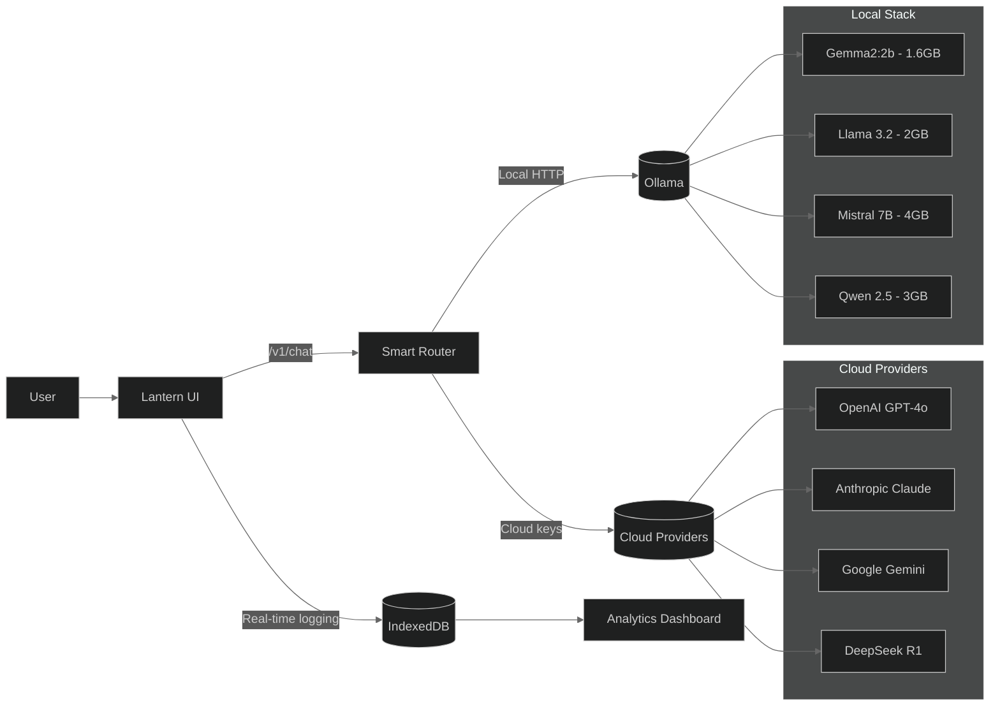
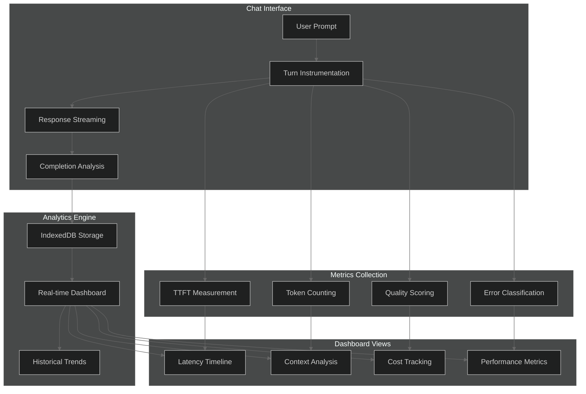

# Lantern — Master Your AI Conversations with Intelligent Prompt Analytics

**Happy Prompting!** Build better prompts, understand what works, and optimize your AI interactions with real-time insights. Lantern combines a distraction-free chat interface with powerful analytics to help you learn how your prompts behave, identify what's going wrong, and improve your results.

<p align="center">
  
  
  
  
</p>


##  Purpose: Learn How Your Prompts Really Behave

**The Problem**: Most people struggle with AI because they don't understand what makes prompts work. They iterate blindly, waste tokens on bad prompts, and never learn from their mistakes.

**The Solution**: Lantern's **Prompt Analytics Dashboard** gives you X-ray vision into your AI conversations:

###  **What the Dashboard Reveals:**
- **Latency Patterns** - See which prompts are slow and why
- **Context Bloat Detection** - Identify when your prompts get too long and expensive
- **Quality Metrics** - Track success vs failure rates across different approaches
- **Token Efficiency** - Understand cost per useful response
- **Model Comparison** - Compare how different models handle your specific use cases
- **Error Analysis** - Learn from refusals, failures, and edge cases
- **Real-time Monitoring** - Watch CPU, memory, and model loading in real-time

###  **Learn What Works:**
- **Temperature Impact** - See how creativity settings affect your results
- **Prompt Length Sweet Spot** - Find the optimal length for your use cases
- **System Message Effectiveness** - Measure how different instructions change behavior
- **Context Window Usage** - Optimize for long conversations
- **Provider Performance** - Compare OpenAI, Anthropic, local models on YOUR prompts

###  **Improve Systematically:**
- **A/B Test Prompts** - Compare variations with real metrics
- **Spot Failure Patterns** - Identify what causes refusals or errors
- **Optimize for Speed** - Find the fastest setup for your workflow
- **Cost Management** - Track spending and find cheaper alternatives
- **Performance Tuning** - Dial in the perfect settings for your needs

##  Why Lantern?

### ** Thoughtful Design**
- **Minimal, fast UI** — Clean dark interface that gets out of your way
- **Smooth streaming** — No jarring jumps or scroll issues during responses
- **Thinking HUD** — See generation progress without cognitive overload
- **Focus-first** — Everything optimized for deep work and experimentation

### ** Universal Compatibility**
- **Cloud + Local** — BYOK for OpenAI/Anthropic/Gemini/DeepSeek OR run Ollama locally
- **Quantized Models** — Optimized for Gemma2:2b (1.6GB), Llama, Mistral on Apple Silicon
- **Performance Mode** — Ultra-fast responses for rapid iteration
- **Auto-detection** — Smart provider selection based on model names

### ** Data-Driven Insights**
- **100% Private** — All analytics data stays in your browser (IndexedDB)
- **Real-time Metrics** — Live charts update as you chat
- **Historical Analysis** — Track improvements over weeks and months
- **Export Capabilities** — Save insights for reports and presentations

### ** Privacy & Security**
- **Local-first** — No data ever leaves your machine
- **BYOK principle** — You control your API keys and data
- **Zero telemetry** — We never see your prompts or responses
- **Offline capable** — Works completely offline with local models

##  Quick Start

### Option 1: Cloud Models (BYOK)
1. **Get API Keys** — Grab keys from OpenAI, Anthropic, Google, or DeepSeek
2. **Open Settings** — Add your provider key in the settings panel
3. **Pick a Model** — Select from latest GPT-4, Claude, Gemini, or DeepSeek models
4. **Start Chatting** — Begin experimenting and watch the analytics

### Option 2: Local with Ollama (Recommended for Learning)
```bash
# Install Ollama
brew install ollama
ollama serve &

# Get optimized quantized models (perfect for experimentation)
ollama pull gemma2:2b          # 1.6GB, very fast
ollama pull llama3.2:3b        # 2GB, good balance
ollama pull mistral:7b         # 4GB, high quality

# Configure Lantern
# Settings → Provider: Local (Ollama) → Model: gemma2:2b
# Performance Mode: ON for ultra-fast responses
```

### Option 3: Mixed Setup (Best of Both Worlds)
- **Local models** for rapid experimentation and learning
- **Cloud models** for production-quality responses
- **Compare performance** directly in the analytics dashboard

##  Analytics Dashboard Deep Dive

Visit `/promptscope` in the app to access your **Prompt Analytics Dashboard**:

### ** Event Latency Timeline**
- Every prompt plotted as individual points
- See **Time to First Token (TTFT)** vs total response time
- Identify slow prompts and optimize them
- Track improvements over time

### ** Context Bloat Analyzer**
- Monitor prompt tokens as % of total context
- Detect when conversations get too expensive
- Find optimal conversation lengths
- Prevent context window overflows

### ** Outcome Mix Tracking**
- Success vs Refusal vs Error rates
- Identify problematic prompt patterns
- Track safety trigger rates
- Optimize for higher success rates

### ** Quality vs Cost Analysis**
- Scatter plots comparing model performance
- Cost-per-useful-response metrics  
- ROI analysis for different providers
- Sweet spot identification for your use cases

### ** Real-time System Metrics**
- **CPU & Memory Usage** — Monitor system load during inference
- **Ollama Status** — Model loading, GPU utilization
- **Network Latency** — API response times
- **Error Monitoring** — Real-time failure detection

### ** Advanced Analytics**
- **Prompt Engineering Insights** — See what structures work best
- **Temperature Impact Analysis** — Understand creativity vs consistency
- **Token Efficiency Metrics** — Cost optimization opportunities
- **Conversation Flow Analysis** — Multi-turn effectiveness

##  Architecture



##  Data Flow - Analytics Engine



##  Features in Detail

### ** Thinking HUD**
Watch your AI "think" with beautiful, non-distracting progress indicators:
- **Generation Phases** — Planning → Drafting → Refining
- **Live Metrics** — Tokens/second, elapsed time, progress estimation
- **Safe Visibility** — Abstract progress without exposing raw reasoning
- **Collapsible Details** — Optional deeper insights when available

### ** Smooth Experience**
- **No-Jump Scrolling** — Perfect scroll behavior during streaming
- **Sticky Auto-Scroll** — Follows responses intelligently
- **Focus Management** — Never lose your place while typing
- **Responsive Design** — Works on desktop, tablet, and mobile

### ** Performance Optimization**

#### **Quantized Local Models**
- **Gemma2:2b** — Q4_0 quantized (1.6GB) for ultra-fast responses
- **Smart Parameter Tuning** — Automatically optimized for quantized models
- **GPU Acceleration** — Metal/CUDA support when available
- **Memory Efficient** — 70% less RAM usage vs full-precision models

#### **Performance Mode (Local)**
Perfect for rapid prompt experimentation:
- **Reduced Context** (512 tokens) for maximum speed
- **Short Responses** (64 tokens) for quick iteration
- **Multi-threading** optimized for your hardware
- **Conversation Management** — Auto-trim to maintain context

##  Development & Setup

### **Prerequisites**
- Node.js 18+ 
- pnpm (recommended) or npm
- For local models: Ollama

### **Installation**
```bash
# Clone the repository
git clone https://github.com/yourusername/lantern.git
cd lantern

# Install dependencies
pnpm install

# Start development servers
pnpm run dev

# Build for production
pnpm run build

# Run tests
pnpm test
```

### **Project Structure**
```
lantern/
├── packages/
│   ├── web/                 # React frontend
│   │   ├── src/
│   │   │   ├── components/  # UI components
│   │   │   ├── promptops/   # Analytics system
│   │   │   ├── hooks/       # Custom React hooks
│   │   │   ├── state/       # State management
│   │   │   └── lib/         # Utilities
│   │   └── public/          # Static assets
│   ├── server/              # Node.js backend
│   │   ├── src/
│   │   │   ├── providers/   # AI provider adapters
│   │   │   ├── routes/      # API endpoints
│   │   │   └── services/    # Business logic
│   │   └── dist/            # Compiled output
│   └── types/               # Shared TypeScript types
├── docs/                    # Documentation
├── quantization-setup.md    # Local model optimization guide
└── README.md               # You are here
```

##  Analytics Dashboard Components

### ** Core Visualizations**
- **Event Timeline** — Time-series plot of all interactions
- **Latency Heatmap** — Response time patterns by hour/day
- **Context Usage** — Prompt vs response token ratios
- **Quality Trends** — Success rates over time
- **Cost Analysis** — Spending breakdown by provider/model

### ** Advanced Analytics**
- **Prompt Engineering Insights** — What patterns work best
- **Model Comparison Matrix** — Head-to-head performance
- **Error Pattern Analysis** — Why prompts fail
- **Conversation Flow Metrics** — Multi-turn effectiveness
- **System Performance** — Resource usage and bottlenecks

### ** Real-time Monitoring**
- **Live System Stats** — CPU, memory, network
- **Model Status** — Loading, ready, error states
- **Queue Management** — Request processing pipeline
- **Health Checks** — Provider availability

##  Privacy & Security

### ** Local-First Architecture**
- **Browser Storage** — All analytics data in IndexedDB
- **No Cloud Dependency** — Works completely offline
- **Client-Side Processing** — Analytics computed locally
- **Export Control** — You decide what to share

### ** Security Best Practices**
- **API Key Protection** — Never logged or transmitted
- **Request Sanitization** — Clean all inputs
- **HTTPS Enforcement** — Secure connections only
- **CSP Headers** — Content Security Policy protection

### ** Data Transparency**
- **Open Analytics** — All metrics calculations visible
- **Data Portability** — Easy export in standard formats
- **Selective Sharing** — Choose what to include in exports
- **Audit Trail** — Track all data operations

##  Use Cases & Workflows

### ** Prompt Engineering**
1. **Experiment** with different prompt structures
2. **Measure** response quality and consistency
3. **Compare** performance across models
4. **Optimize** for speed, cost, or quality
5. **Document** what works for future use

### ** Learning & Research**
1. **Study** how different models respond to your domain
2. **Analyze** failure modes and edge cases
3. **Track** improvement over time
4. **Share** insights with your team
5. **Build** prompt libraries based on data

### ** Production Optimization**
1. **Monitor** production prompt performance
2. **A/B test** changes before deployment
3. **Cost optimize** by finding efficient alternatives
4. **Quality assurance** through systematic testing
5. **Scale** insights across your organization

##  Contributing

We welcome contributions! Here's how to get started:

### ** Bug Reports**
1. Check existing issues first
2. Include detailed reproduction steps
3. Provide system information
4. Add screenshots if applicable

### ** Feature Requests**
1. Describe the use case clearly
2. Explain the expected behavior
3. Consider implementation complexity
4. Discuss alternatives

### ** Code Contributions**
1. Fork the repository
2. Create a feature branch
3. Follow our coding standards
4. Add tests for new features
5. Update documentation
6. Submit a pull request

### ** Documentation**
- Improve setup instructions
- Add usage examples
- Create tutorials
- Fix typos and clarity issues

##  Roadmap

### ** Near Term**
- [ ] More visualization types (sankey diagrams, network graphs)
- [ ] Custom dashboard builder
- [ ] Prompt template library
- [ ] Advanced filtering and search
- [ ] Team collaboration features

### ** Medium Term**
- [ ] Machine learning insights (automatic pattern detection)
- [ ] Integration with popular prompt engineering tools
- [ ] Advanced A/B testing framework
- [ ] Custom model fine-tuning integration
- [ ] Enterprise SSO and user management

### ** Long Term**
- [ ] Multi-user analytics and sharing
- [ ] Automated prompt optimization
- [ ] Industry-specific prompt libraries
- [ ] Advanced cost prediction models
- [ ] Real-time collaborative editing

##  License

MIT License - see [LICENSE](LICENSE) for full details.

##  Acknowledgments

- **Ollama** for making local AI accessible
- **OpenAI, Anthropic, Google** for excellent APIs
- **React & TypeScript** communities for great tools
- **All contributors** who make this project better

---

## **Happy Prompting!** 

*Lantern: Master your AI conversations with data-driven insights. Learn what works, fix what doesn't, and optimize systematically.*

**Start your journey**: `pnpm install && pnpm run dev`