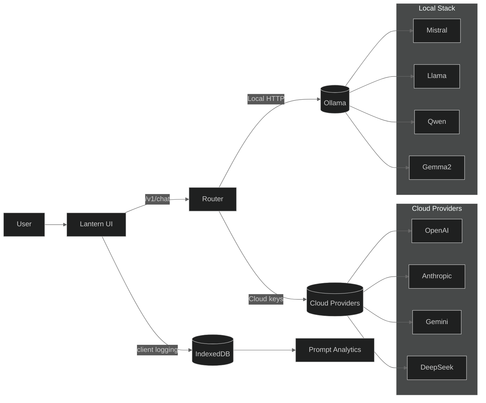
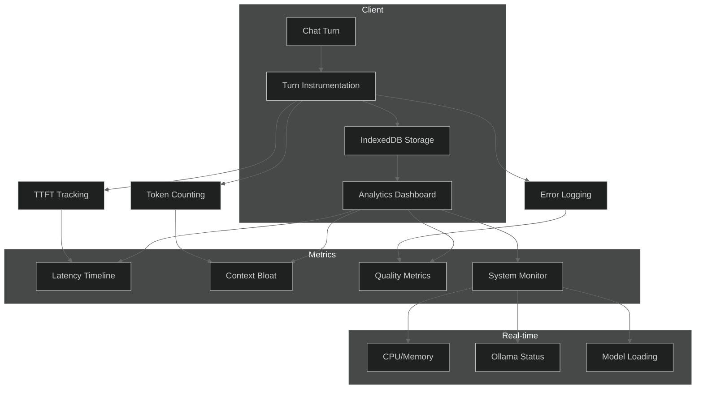

# Lantern — Minimalist chat UI for cloud & local LLMs with built-in Prompt Analytics

Build better prompts, faster responses, and clearer insights. Lantern pairs a distraction-free dark UI with first-class support for **BYOK cloud models** and **local Ollama models**—plus an on-device **Prompt Analytics** dashboard that helps you see how prompt choices affect **latency, cost, and helpfulness**.

<p align="center">
  
  
  
  
</p>


## Why Lantern?

- **Minimal, fast UI** — thoughtfully spaced, opaque panels, no visual noise
- **Cloud + Local** — plug your keys or run Mistral/Qwen/Llama via Ollama on Apple Silicon
- **Prompt Analytics** — latency per turn, TTFT, context bloat, outcome mix, model comparisons
- **Thinking HUD** — abstract progress (elapsed, tok/s, phases) during generation; no raw chain-of-thought
- **Smooth scroll** — no jarring jumps when streaming responses
- **100% local-first** — integrates without altering your existing API shapes

## Quick Start

### Cloud (BYOK)
1. Open Settings → add your provider key (OpenAI/Anthropic/Gemini/DeepSeek)
2. Pick a model and chat

### Local with Ollama
```bash
# Install Ollama
brew install ollama
ollama serve &

# Get a lightweight model
ollama pull gemma2:2b

# Configure Lantern
# Settings → Provider: Local (Ollama) → Model: gemma2:2b
# Optional: Performance Mode ON for ultra-fast responses
```

### Prompt Analytics
- Visit `/promptscope` (displays as **Prompt Analytics** in the UI)
- Charts include:
  - **Event Latency Timeline** (each prompt as individual points)
  - **Context Bloat trend** (prompt tokens % of total)
  - **Outcome Mix** (OK/Refusal/Error rates)  
  - **Quality vs Cost** scatter by model
  - **Real-time system metrics** (CPU, memory, Ollama status)

## Architecture



## Data Flow - Prompt Analytics



## Features in Detail

### Thinking HUD
- **Abstract progress** during model generation
- **Phases**: Planning → Drafting → Refining
- **Metrics**: Elapsed time, tokens/second estimate
- **Safe**: No raw chain-of-thought exposure
- **Collapsible**: Optional reasoning summaries (when available)

### Smooth Scroll
- **No jumps** when pressing Enter to send messages
- **Sticky bottom** behavior during streaming
- **Smooth reveals** of assistant responses
- **Focus-safe** scroll management

### Prompt Analytics Dashboard
- **Event timeline**: Every prompt plotted with latency/TTFT
- **Context efficiency**: Track prompt bloat over time
- **Model comparison**: Quality vs cost scatter plots
- **System monitoring**: Real-time CPU/memory/Ollama status
- **Privacy-first**: All data stays in browser IndexedDB

### Performance Mode (Local)
- **Ultra-fast** responses on Apple Silicon
- **Reduced context** (512 tokens) for speed
- **Short outputs** (64 tokens) for rapid iteration
- **Conversation trimming** to maintain context
- **2-thread limit** to prevent system overload

## Development

```bash
# Install dependencies
pnpm install

# Start development
pnpm run dev

# Build production
pnpm run build

# Run tests
pnpm run test
```

## File Structure

```
├── packages/
│   ├── web/           # React frontend
│   │   ├── src/
│   │   │   ├── components/   # UI components
│   │   │   ├── promptops/    # Analytics system
│   │   │   └── hooks/        # Smooth scroll, etc.
│   └── server/        # Node.js backend
│       ├── src/
│       │   ├── providers/    # Cloud/local adapters
│       │   └── routes/       # API endpoints
└── README.md          # You are here
```

## Privacy & Security

- **Local-first**: Analytics data stays in your browser
- **No telemetry**: Zero data leaves your machine
- **Key security**: API keys never logged or exposed
- **BYOK principle**: You control your data and keys
- **Local Ollama**: Runs entirely on your hardware

## Contributing

1. Fork the repo
2. Create a feature branch
3. Make your changes
4. Test locally
5. Submit a PR

## License

MIT License - see [LICENSE](LICENSE) for details.

---

*Lantern: Light up your AI conversations with clarity and insight.*
