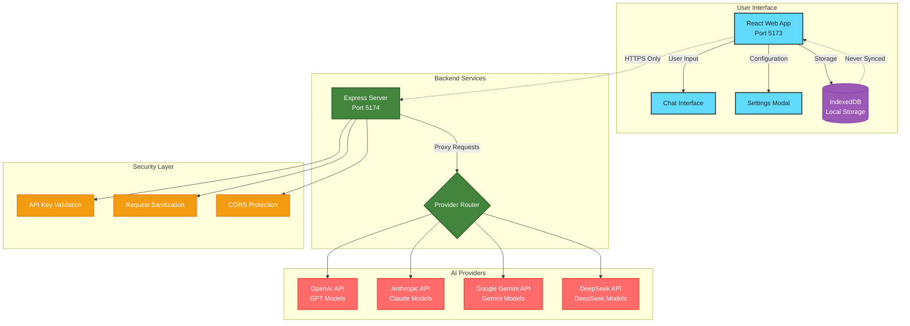
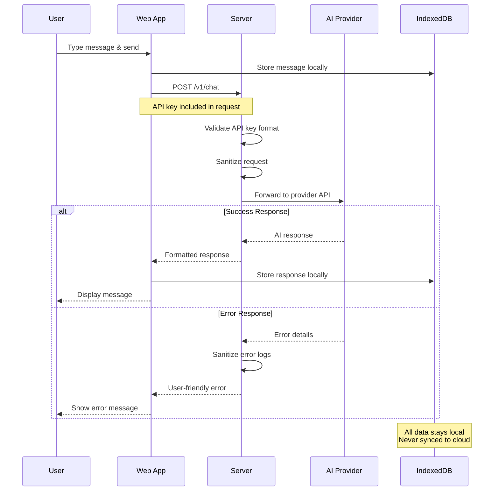
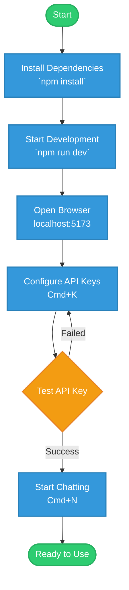
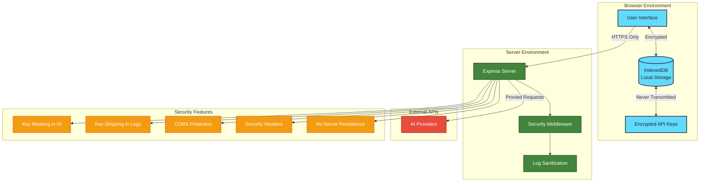
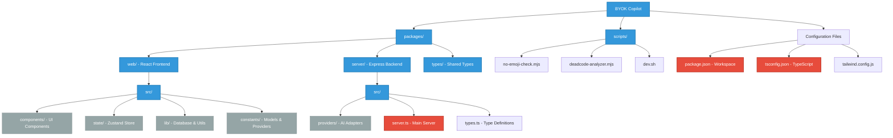
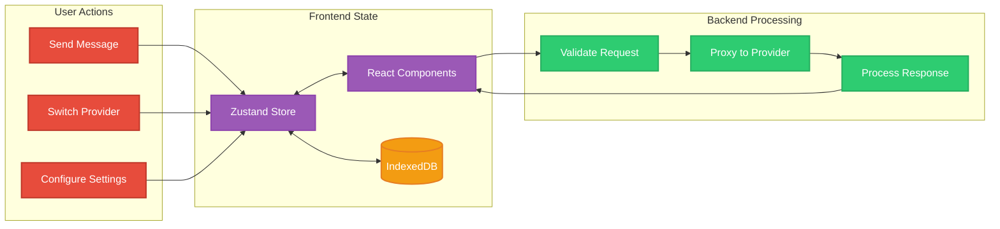
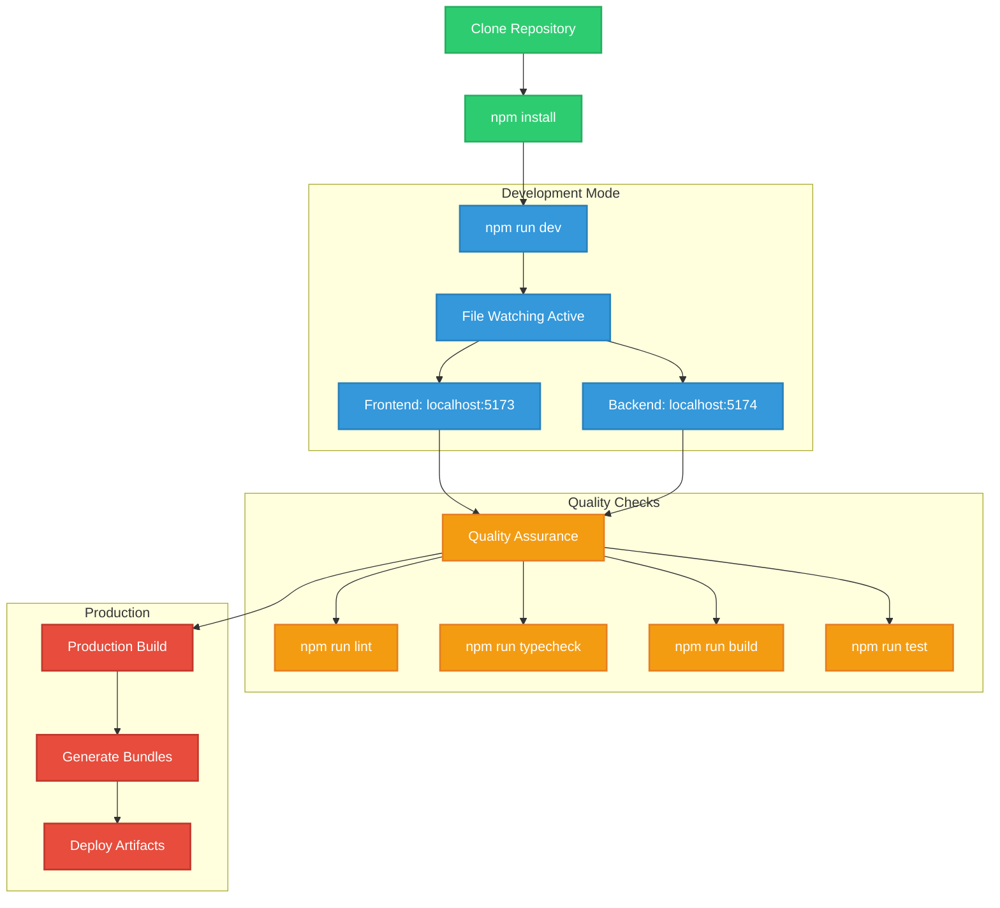
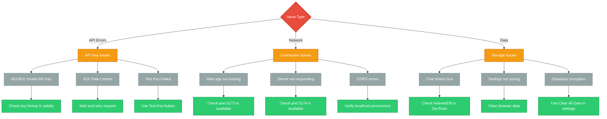

# BYOK Copilot

<p align="center">
  
  
  
  
</p>

<p align="center">
  <strong>A world-class, local-only, bring-your-own-key AI chat application</strong><br>
  Supporting multiple providers with a beautiful dark interface and zero telemetry
</p>


---

## Architecture Overview



## Request Flow



## Features

- **Local-Only & Secure**: API keys never leave your browser. Zero telemetry, zero tracking.
- **Multi-Provider Support**: OpenAI, Anthropic (Claude), Google Gemini, and DeepSeek
- **Persistent Conversations**: Chat history stored locally with IndexedDB
- **Beautiful Dark Theme**: Full-bleed, opaque surfaces designed for extended use
- **Keyboard Shortcuts**: Cmd+N (new chat), Cmd+K (settings), Escape (close modals)
- **Dynamic Configuration**: Per-provider API keys and model selection
- **Key Validation**: Test your API keys before using them
- **Conversation Management**: Rename, delete, and organize your chats
- **Git-Safe**: Push protection to prevent accidental key exposure

## Quick Start



### Installation Commands

```bash
# 1. Install dependencies
npm install

# 2. Start development servers
npm run dev

# 3. Open in browser
# Web: http://localhost:5173
# API: http://localhost:5174
```

## Supported AI Providers

```mermaid
graph LR
    subgraph "OpenAI"
        O1[GPT-4o]
        O2[GPT-4o-mini]
        O3[GPT-4-turbo]
        O4[GPT-3.5-turbo]
    end
    
    subgraph "Anthropic"
        A1[Claude-3.5-Sonnet]
        A2[Claude-3.5-Haiku]
        A3[Claude-3-Opus]
    end
    
    subgraph "Google"
        G1[Gemini-1.5-Pro]
        G2[Gemini-1.5-Flash]
        G3[Gemini-1.0-Pro]
    end
    
    subgraph "DeepSeek"
        D1[DeepSeek-Chat]
        D2[DeepSeek-Coder]
        D3[DeepSeek-Reasoner]
    end
    
    USER[User Input] --> ROUTER{Provider Router}
    ROUTER --> OpenAI
    ROUTER --> Anthropic
    ROUTER --> Google
    ROUTER --> DeepSeek
    
    classDef openai fill:#10A37F,stroke:#0F9C75,stroke-width:2px,color:white
    classDef anthropic fill:#D97757,stroke:#C5684A,stroke-width:2px,color:white
    classDef google fill:#4285F4,stroke:#357ABD,stroke-width:2px,color:white
    classDef deepseek fill:#6C5CE7,stroke:#5A4FCF,stroke-width:2px,color:white
    classDef router fill:#2D3436,stroke:#636E72,stroke-width:2px,color:white
    
    class O1,O2,O3,O4 openai
    class A1,A2,A3 anthropic  
    class G1,G2,G3 google
    class D1,D2,D3 deepseek
    class ROUTER,USER router
```

| Provider | Models | API Key Format | Get Key |
|----------|--------|----------------|---------|
| **OpenAI** | gpt-4o, gpt-4o-mini, gpt-4-turbo, gpt-3.5-turbo | `sk-...` | [Platform](https://platform.openai.com/api-keys) |
| **Anthropic** | claude-3-5-sonnet, claude-3-5-haiku, claude-3-opus | `sk-ant-...` | [Console](https://console.anthropic.com/) |
| **Google Gemini** | gemini-1.5-pro, gemini-1.5-flash, gemini-1.0-pro | API key | [AI Studio](https://aistudio.google.com/) |
| **DeepSeek** | deepseek-chat, deepseek-coder, deepseek-reasoner | `sk-...` | [Platform](https://platform.deepseek.com/) |

## Security Model



## Project Structure



## Data Flow & State Management



## Development Workflow



## Keyboard Shortcuts

| Shortcut | Action |
|----------|--------|
| `Cmd+N` / `Ctrl+N` | New chat |
| `Cmd+K` / `Ctrl+K` | Open settings |
| `Escape` | Close modal |
| `Enter` | Send message |
| `Shift+Enter` | New line in message |

## Configuration

### Environment Variables (Optional)

Create `packages/server/.env.local`:

```bash
# Custom API endpoints (optional)
OPENAI_BASE_URL=https://api.openai.com/v1
ANTHROPIC_BASE_URL=https://api.anthropic.com/v1
GEMINI_BASE_URL=https://generativelanguage.googleapis.com
DEEPSEEK_BASE_URL=https://api.deepseek.com/v1

# Anthropic version
ANTHROPIC_VERSION=2023-06-01

# Server port  
PORT=5174
```

### Available Scripts

```bash
# Development
npm run dev          # Start both frontend and backend
npm run build        # Build production bundles
npm run start        # Start production server
npm run clean        # Clean build artifacts

# Quality Assurance
npm run lint         # Run ESLint + emoji check
npm run typecheck    # Run TypeScript compiler
npm run test         # Run test suite
npm run ci:no-emoji  # Check for emoji violations

# Utilities
npm run deadcode     # Analyze unused code
```

## Troubleshooting

### Common Issues & Solutions



## Contributing

We welcome contributions! Please see our contributing guidelines:

1. Fork the repository
2. Create a feature branch
3. Make your changes
4. Run quality checks: `npm run lint && npm run typecheck`
5. Submit a pull request

### Code Quality Standards

- **TypeScript**: Strict mode enabled
- **ESLint**: Airbnb configuration
- **Prettier**: Consistent formatting
- **No Emojis**: Enforced by pre-commit hooks
- **Security**: API key sanitization required

## License

MIT License - Use at your own risk.

---

<p align="center">
  <strong>Security Reminder</strong><br>
  Keep your API keys secure and never commit them to version control!
</p>

<p align="center">
  Made with care for developers who value privacy and local-first software
</p>